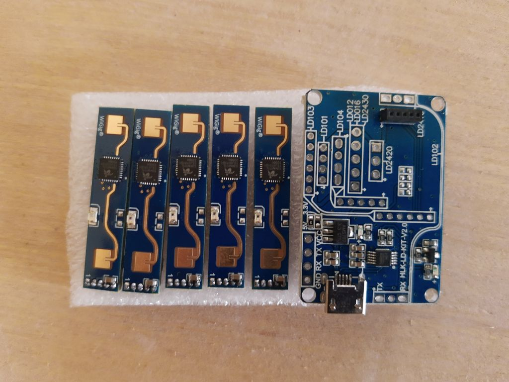

# LD2410
## Introduction

(RAEDME from : https://github.com/ncmreynolds/ld2410)
A Python example for the Hi-Link LD2410 24Ghz FMCW radar sensor. This sensor is a Frequency Modulated Continuous Wave radar, which makes it good for presence detection and its sensitivity at different ranges to both static and moving targets can be configured.

## Connections

The module must be powered by 5V or higher, but does 3.3v I/O, please consider this when working with the module.

The default header pitch is 1.27mm, half the size of the usual 0.1" hobbyist pin headers so you may need to buy some, or carefully de-solder the existing pins to use the module.

If you have the breakout board, you can use the VCC, GND, TX and RX pins to work with the module.
